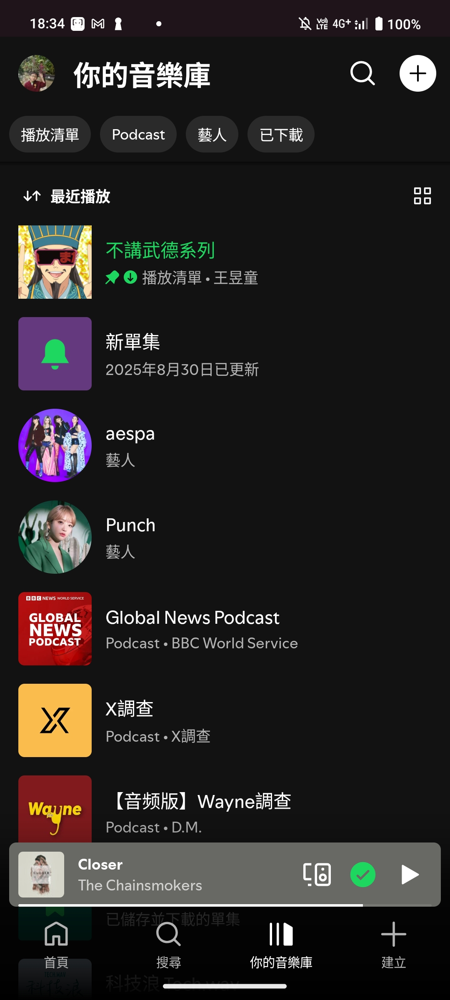

# imitation Spotify

 這個作業是一個 Spotify 風格的音樂播放介面練習，主要透過 SwiftUI 實作首頁 HomeView，包含動態問候語、分類選擇按鈕、快速存取的歌單格子、熱門混合與最近播放的水平捲動列表，並支援點擊歌曲播放功能，同時練習使用 ScrollView、LazyVGrid、ForEach 及狀態管理 (@State) 等 SwiftUI 核心元件。

 My spotify
 
  

imitation spotify

   

demo video
https://www.youtube.com/shorts/RHhUCYAt7Ic
